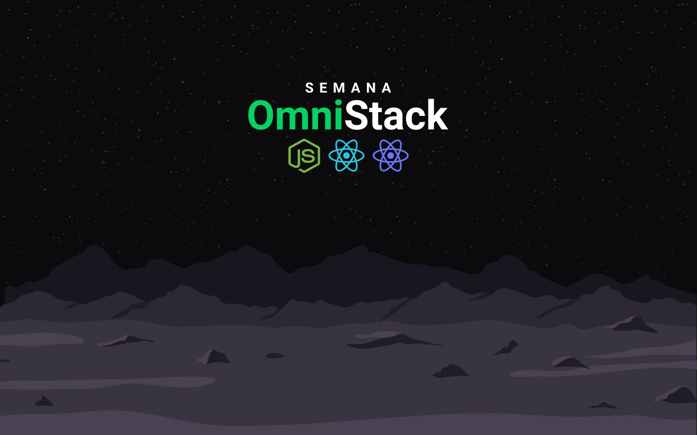
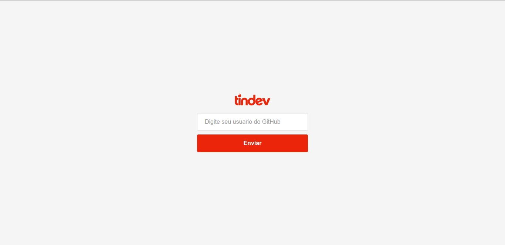
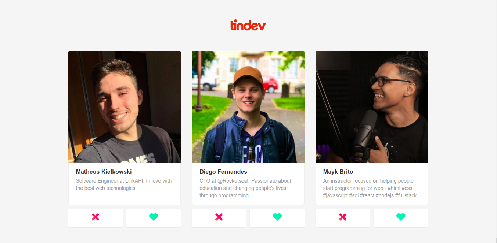
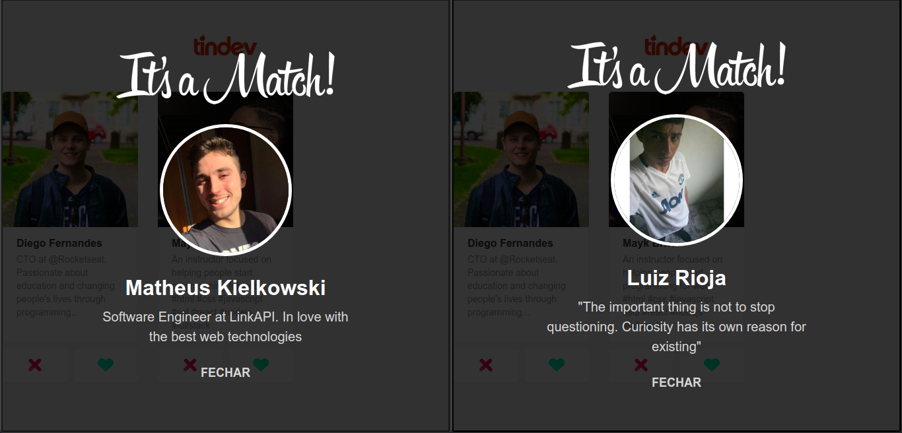
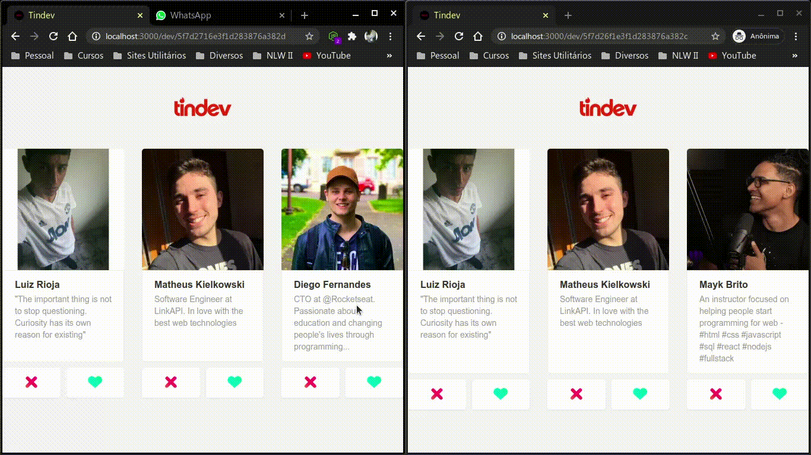
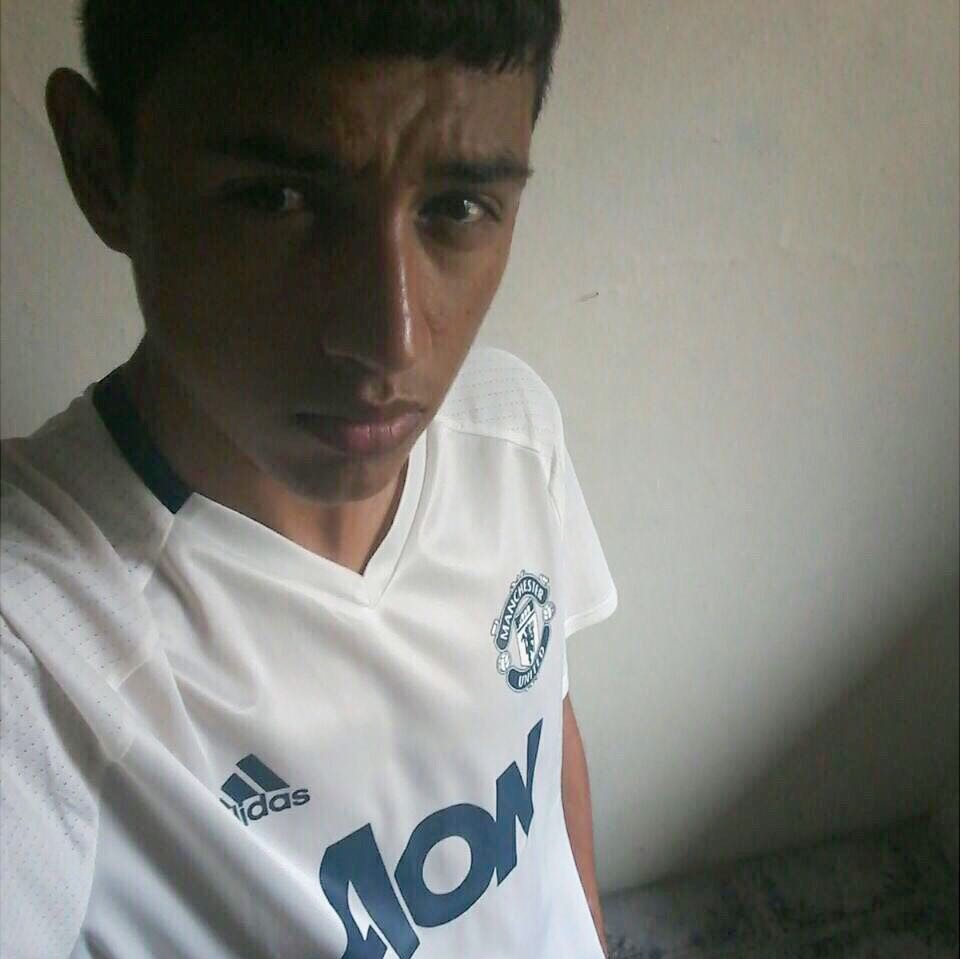

  
   

<h3 align="center">
Uma espécie de "Tinder" para os Devs.
</h3>

  

  
  

 

  <a href="#sobre">Sobre</a> •
  <a href="#tindev">Tindev</a> •
  <a href="#tecnologias">Tecnologias</a> •
  <a href="#autor">Autor</a>

   

## Sobre

  Projeto desenvolvido durante a <strong>Semana OmniStack 8</strong>, evento criado pela <strong><a href="https://rocketseat.com.br/">Rocketseat</a></strong>.   
  Um evento 100% online e GRATUITO, com conteúdo exclusivo e INÉDITO.

Ocorreu do dia 05 ao dia 11 de Agosto de 2019 e teve como intuito mostrar na prática o poder da stack
<strong><a href="https://nodejs.org/pt-br/">NodeJS</a></strong> +
<strong><a href="https://pt-br.reactjs.org/">ReactJS</a></strong> +
<strong><a href="https://reactnative.dev">React Native</a></strong> e como essas tecnologias podem te levar até os seus maiores objetivos como programador.

  

   

## Tindev

  O Tindev tem como objetivo unir programadores com interesses em comum para, quem sabe, construir projetos juntos ou até mesmo trocar experiências sobre esse mundo louco da programação...😅

A aplicação funciona como um Tinder, onde a pessoa se loga com o usuário do
<strong>
<a href="https://github.com/">Github</a>
</strong>
através dessa tela:

 

  

E logo após é direcionada para a tela principal onde estarão os cards dos outros usuários cadastrados na plataforma, conforme imagem abaixo:

 

  

Os cards contêm o nome e descrição dos Devs cadastrados, além dos botões de <strong>DISLIKE</strong> e <strong>LIKE</strong>.
Quando o Dev logado dá um like em um usuário da lista que deu like nele num outro momento, acontece o que é chamado de <strong>MATCH</strong>.

Esse evento é sinalizado para ambos os usuários em tempo real, utilizando Websocket. Assim que ocorre o match é apresentado na tela do usuário a seguinte tela:

 

  

Aqui temos uma demostração do evento de match desde o início. O usuário da esquerda da um like no usuário da direita, que momentos depois dá um like do Dev que curtiu o perfil dele e pronto...

  

  

   

## Tecnologias

   

## Autor

<h1 style="margin-bottom: 0">Luiz Rioja</h1>
<h4 style="margin-top: 0">Backend Developer</h4>

  

